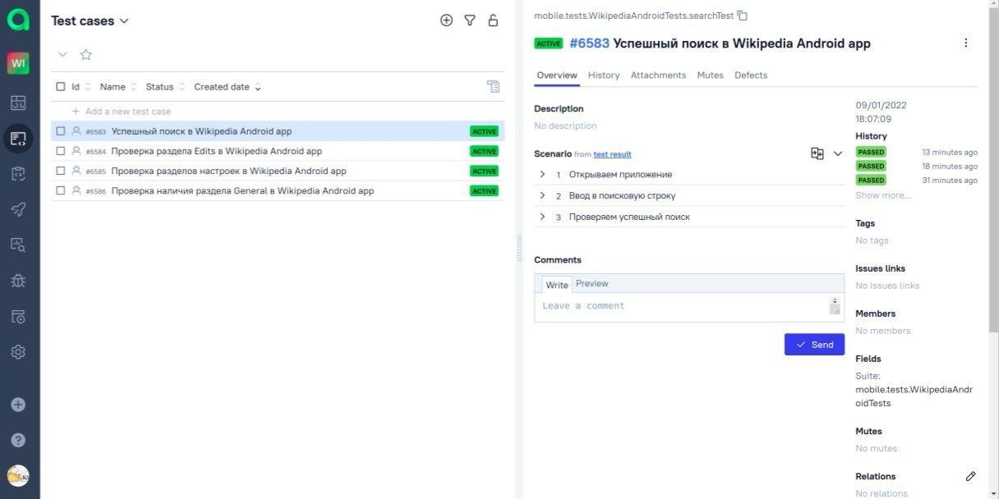

# Wikipedia
#   Проект для мобильного приложения Wikipedia


___

Реализован запуск автотестов на следующем окружении:

remote emulator device (Selenoid);

local emulator device (AVD);

local real device.
___

## :person_in_tuxedo: Запуск тестов происходит в CI [Jenkins](http://localhost:9090/job/08-Veronika_Monarkhovich-Wikipedia/)

 

**Создаем emulator.properties:**

```bash
src/test/resources/emulator.properties
```
Text File Content:
```bash
url = http://172.17.0.1:4723/wd/hub
device = Test2
ver = 11.0
```
**Создаем local.properties:**

```bash
src/test/resources/local.properties
```
Text File Content:
```bash
url = http://172.17.0.1:4723/wd/hub
device = XSQ4C18B14000291
ver = 8.1
```
**Создаем selenoid.properties:**

```bash
src/test/resources/selenoid.properties
```
Text File Content:
```bash
url=http://172.17.0.1:4444/wd/hub
```
Запуск тестов:
- в параметре -DdeviceHost=${DEVICE_HOST} задаем хост
```bash
clean test -DdeviceHost=${DEVICE_HOST} 
```

Генерация отчета:
```bash
allure serve 
```
```bash
build/allure-results
```
___

## :bar_chart: Отчет генерируется в Allure


___

##  Тестовая документация, сгенерированная в Allure TestOps по итогам прохождения тестов

 

___
##  Задача в таск-трекере Jira с данными, экспортированными из Allure TestOps

 

___

## :calling: Уведомления о прохождение тестов отправляются в Telegram

 

___

## :movie_camera: Видеотчет теста "Успешный поиск в Wikipedia Android app"

 

## :movie_camera: Видеотчет теста "Проверка раздела Edits в Wikipedia Android app"

 